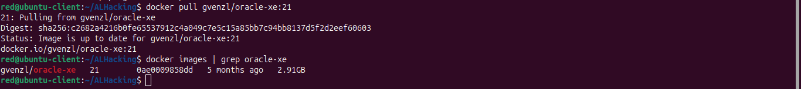

# Compte Rendu - TP1 : Installation et Gestion d'Oracle 21c XE sur Docker

**Préparé par :** Otmanesabiri  
**Date :** 17 Mars 2025  
**Login :** Otmanesabiri

## Introduction

Ce document décrit les étapes suivies pour l'installation d'Oracle Database 21c XE à l'aide de Docker, ainsi que les différentes commandes utilisées pour la gestion de l'instance et la consultation du dictionnaire des données. Toutes les commandes ont été exécutées sur une machine locale avec Docker.

## Partie 1 : Installation d'Oracle

### 1.1. Téléchargement et installation de Docker (déjà réalisée)

```bash
# Vérifier si Docker est installé et sa version
docker --version

# Vérifier l'état du service Docker
systemctl status docker

# Vérifier les droits utilisateur sur Docker
groups | grep docker
```


### 1.2. Téléchargement de l'image Oracle

```bash
# Télécharger l'image Oracle Database 21c XE
docker pull gvenzl/oracle-xe:21

# Vérifier si l'image est disponible localement
docker images | grep oracle-xe
```


### 1.3. Création et démarrage du conteneur Oracle

```bash
# Créer et démarrer le conteneur Oracle 21c
docker run -d \
  --name glsid2025 \
  --restart=unless-stopped \
  -p 1521:1521 \
  -p 5500:5500 \
  -e ORACLE_PASSWORD=Glsid2024-2025 \
  gvenzl/oracle-xe:21

# Vérifier le démarrage
docker logs -f glsid2025
```
 


## Partie 2 : Gestion d'instance

### 2.1. Vérification du contenu de la base de données et répertoires

```bash
# Accéder au conteneur
docker exec -it glsid2025 bash

# Explorer les répertoires
ls -la /opt/oracle
ls -la /opt/oracle/oradata
ls -la /opt/oracle/product
```


### 2.2. Identification de la valeur SID

```bash
# Connecter à SQL*Plus en tant que SYS
docker exec -it glsid2025 sqlplus / as sysdba

# Une fois connecté à SQL*Plus, exécutez :
ALTER USER SYS IDENTIFIED BY "Glsid2024-2025";

#vérification les utilisateurs existants et leur statut
SELECT username, account_status FROM dba_users ORDER BY username;

# Exécuter les requêtes suivantes
SELECT distinct sid FROM v$mystat;
SELECT * FROM global_name;
SELECT instance FROM v$thread;
```


### 2.3. Identification des services Oracle

```bash
# Dans le conteneur
docker exec -it glsid2025 bash -c "ps -ef | grep oracle"

# Vérifier les processus en cours d'exécution
SELECT spid, program FROM v$process;
EOF
# Afficher les noms et descriptions des processus en arrière-plan
SELECT name, description FROM v$bgprocess WHERE paddr != '00';

# Afficher l'état de l'instance
SELECT instance_name, status FROM v$instance;

# Afficher les utilisateurs connectés
SELECT username, sid, serial# FROM v$session;
```
# Vérifier les processus en cours d'exécution


# Afficher les noms et descriptions des processus en arrière-plan


### 2.4. Connexion à Oracle Enterprise Manager

```bash
# Vérifier que le port 5500 est accessible
curl -I http://localhost:5500/em

# Ouvrir dans un navigateur
echo "Ouvrir http://localhost:5500/em dans votre navigateur"
echo "Utilisateur: sys"
echo "Mot de passe: Glsid2024-2025"
echo "Connexion en tant que: sysdba"
```


notez qu'il faut HTTP activé dans la base de donnée oracle crée cela ça va marcher avec EM DataBase Express Edition

### 2.5. Lancement du processus d'écoute Oracle (Listener)

```bash
# Vérifier l'état du listener
docker exec -it glsid2025 lsnrctl status

# Arrêter le listener (pour démontrer la commande)
docker exec -it glsid2025 lsnrctl stop

# Démarrer le listener
docker exec -it glsid2025 lsnrctl start
```

### 2.6. Identification de la base de données

```bash
docker exec -it glsid2025 sqlplus sys/Glsid2024-2025@XE as sysdba << EOF
SELECT name, db_unique_name, open_mode FROM v\$database;
EXIT;
EOF
```

### 2.7. Démarrage de l'instance Oracle

```bash
# Arrêter d'abord l'instance pour démontrer le redémarrage
docker exec -it glsid2025 sqlplus sys/Glsid2024-2025@XE as sysdba << EOF
SHUTDOWN IMMEDIATE;
STARTUP;
EXIT;
EOF
```

### 2.8. Accès avec SQL*Plus en tant que SYS

```bash
docker exec -it glsid2025 sqlplus sys/Glsid2024-2025@XE as sysdba
```


# Solution alternative
 c'est d'utiliser SqlDevelopper en le téléchargant via le site d'oracle.

# installation de SqlDevelopper

```bash
# Télécharger SqlDevelopper
unzip ~/Téléchargements/sqldeveloper-24.3.1.347.1826-no-jre -d ~/
# Entrez dans le répertoire de SQL Developer
cd ~/sqldeveloper

# rendre executable le fichier sqldeveloper.sh
chmod +x sqldeveloper.sh

# lancer sqldeveloper.sh
./sqldeveloper.sh
```

Après l'installation et exécution on se connect, pour mon cas je connecte avec les cordonnées suivantes: 

# 2.9. Accès avec SQL Developer

 ```bash
 Connection Name: GLSID2025
Connection Type: Basic
Username: sys
Password: Glsid2024-2025
Role: SYSDBA
Hostname: localhost
Port: 1521
Service name: XE  (or try xepdb1 for the pluggable database)
 ```
Note : assurer que base de donnée est démarée
 ```bash
 docker exec -it glsid2025 /bin/bash
 sqlplus / as sysdba
```

-- If not OPEN, start the database
STARTUP;

 


# Exemple : création de la table students 
```sql
CREATE TABLE students (
    student_id NUMBER PRIMARY KEY,
    first_name VARCHAR2(50),
    last_name VARCHAR2(50),
    enrollment_date DATE
);

```

 


### 2.10. Modification des paramètres de l'instance en lecture seule

```bash
docker exec -it glsid2025 sqlplus sys/Glsid2024-2025@XE as sysdba << EOF
SHUTDOWN IMMEDIATE;
STARTUP MOUNT;
ALTER DATABASE OPEN READ ONLY;
SELECT open_mode FROM v\$database;

-- Rétablir en lecture/écriture
SHUTDOWN IMMEDIATE;
STARTUP;
SELECT open_mode FROM v\$database;
EXIT;
EOF
```


### 2.11. Vérification des comptes utilisateurs et mots de passe

```bash
docker exec -it glsid2025 sqlplus sys/Glsid2024-2025@XE as sysdba << EOF
SELECT username, account_status FROM dba_users ORDER BY username;
EXIT;
EOF
```
qlq utilisateur qui sont OPEN

 


### 2.12. Activation du compte HR

```bash
docker exec -it glsid2025 sqlplus sys/Glsid2024-2025@XE as sysdba 
```
```sql
-- Vérifier si HR existe
SELECT username, account_status FROM dba_users WHERE username = 'HR';

-- S'il existe mais est verrouillé, l'activer
ALTER USER HR IDENTIFIED BY "Hr2024" ACCOUNT UNLOCK;

-- Si HR n'existe pas, le créer (dans Oracle 21c XE sur Docker)
CREATE USER hr IDENTIFIED BY "Hr2024";
GRANT CONNECT, RESOURCE TO hr;
GRANT CREATE VIEW TO hr;
GRANT UNLIMITED TABLESPACE TO hr;

EXIT;
```
 


### 2.13. Identification du fichier de paramètres du serveur

 ```bash
 docker exec -it glsid2025 /bin/bash
 sqlplus / as sysdba

```
puis 
```sql
-- This is the correct syntax for querying v$ tables
SELECT name, value FROM v$parameter WHERE name = 'spfile';

-- Check database status
SELECT status FROM v$instance;

-- Check if all PDBs are open
SELECT name, open_mode FROM v$pdbs;

-- Check service names
SELECT value FROM v$parameter WHERE name = 'service_names';

-- Register database with listener
ALTER SYSTEM REGISTER;
```


### 2.14. Identification des espaces disque logiques et fichiers de données

```bash
docker exec -it glsid2025 sqlplus sys/Glsid2024-2025@XE as sysdba 
SELECT tablespace_name, status FROM dba_tablespaces;
SELECT file_name, tablespace_name, bytes/1024/1024 "Size (MB)" FROM dba_data_files;
EXIT;
```


### 2.15. Identification des fichiers journaux de rétablissement

```bash
docker exec -it glsid2025 sqlplus sys/Glsid2024-2025@XE as sysdba 
SELECT group#, member FROM v$logfile;
EXIT;
```


### 2.16. Identification des fichiers de contrôle

```bash
docker exec -it glsid2025 sqlplus sys/Glsid2024-2025@XE as sysdba 
SELECT name FROM v$controlfile;
EXIT;
```


### 2.17. Identification du référentiel de diagnostic automatique (ADR)

```bash
docker exec -it glsid2025 sqlplus sys/Glsid2024-2025@XE as sysdba 
SHOW PARAMETER diagnostic_dest;
SELECT name, value FROM v$diag_info;
EXIT;
```

 


### 2.18. Arrêt du listener

```bash
docker exec -it glsid2025 lsnrctl stop
```

### 2.19. Arrêt de l'instance Oracle avec différentes options

```bash
# NORMAL
docker exec -it glsid2025 sqlplus sys/Glsid2024-2025@XE as sysdba << EOF
SHUTDOWN NORMAL;
STARTUP;
EXIT;
EOF

# TRANSACTIONAL
docker exec -it glsid2025 sqlplus sys/Glsid2024-2025@XE as sysdba << EOF
SHUTDOWN TRANSACTIONAL;
STARTUP;
EXIT;
EOF

# IMMEDIATE
docker exec -it glsid2025 sqlplus sys/Glsid2024-2025@XE as sysdba << EOF
SHUTDOWN IMMEDIATE;
STARTUP;
EXIT;
EOF

# ABORT
docker exec -it glsid2025 sqlplus sys/Glsid2024-2025@XE as sysdba << EOF
SHUTDOWN ABORT;
STARTUP;
EXIT;
EOF
```

## Partie 3 : Consultation du dictionnaire des données

### 3.1-3.15. Exécution des requêtes demandées

```bash
docker exec -it glsid2025 sqlplus sys/Glsid2024-2025@XE as sysdba 
```


```sql
-- 2. Views with ALL_ prefix (all accessible objects)
SELECT OWNER, OBJECT_NAME, OBJECT_TYPE
FROM DBA_OBJECTS
WHERE OBJECT_NAME LIKE 'ALL_%' AND ROWNUM <= 20
ORDER BY OWNER, OBJECT_NAME;
```
 
 
 
 


```sql
--3. Views with USER_ prefix (current user's objects)
SELECT OBJECT_NAME, OBJECT_TYPE
FROM USER_OBJECTS
WHERE OBJECT_NAME LIKE 'USER_%' AND ROWNUM <= 20
ORDER BY OBJECT_NAME;
```

 
 


```sql
--4. Public synonyms
SELECT OWNER, SYNONYM_NAME, TABLE_OWNER, TABLE_NAME
FROM ALL_SYNONYMS 
WHERE OWNER = 'PUBLIC' AND ROWNUM <= 20;
```
 


```sql
--5. Data dictionary cache
SELECT * FROM DICTIONARY WHERE TABLE_NAME LIKE '%CACHE%';
```


```SQL
--6. Background processes
-- First, let's see the structure of the view
DESC V$BGPROCESS;

SELECT * FROM V$BGPROCESS WHERE ROWNUM <= 10;
```


```sql
-- 7. Instance information
SELECT instance_name, version, host_name, status FROM V$INSTANCE;
```


```sql
--8. Database information
SELECT name, created, log_mode, open_mode FROM V$DATABASE;
```


```sql
-- 9. Database parameters
COLUMN NAME FORMAT A30
COLUMN VALUE FORMAT A50
SELECT name, value FROM V$PARAMETER WHERE ROWNUM <= 20;
```


```sql
-- 10. Control file locations
SELECT name FROM V$CONTROLFILE;
```


```sql
--11. Redo log file locations
COLUMN MEMBER FORMAT A50
COLUMN STATUS FORMAT A10
SELECT GROUP#, MEMBER, STATUS FROM V$LOGFILE;

```


```sql
-- 12. Tablespaces
DES V$TABLESPACE;

```


```sql
-- 13. Datafile information
COLUMN NAME FORMAT A50
SELECT name, block_size FROM V$DATAFILE;
```


```sql
-- 14. Tablespace-datafile mapping
COLUMN DATAFILE_NAME FORMAT A45
COLUMN TABLESPACE_NAME FORMAT A20
SELECT d.name AS datafile_name, t.name AS tablespace_name 
FROM V$DATAFILE d 
JOIN V$TABLESPACE t ON d.ts# = t.ts#;
```


```sql
-- 15. PDB information (for multitenant architecture)
SELECT name, open_mode, restricted FROM V$PDBS;
EXIT;
```

## Conclusion

Ce TP a permis de découvrir et de valider les différentes étapes nécessaires pour installer et configurer une base de données Oracle 21c XE à l'aide de Docker, ainsi que pour gérer l'instance et consulter le dictionnaire des données. Les commandes et captures d'écran fournies dans ce document démontrent la réalisation des tâches demandées.
